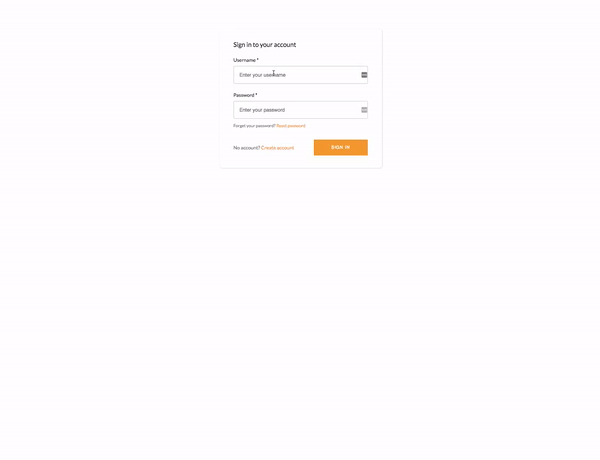
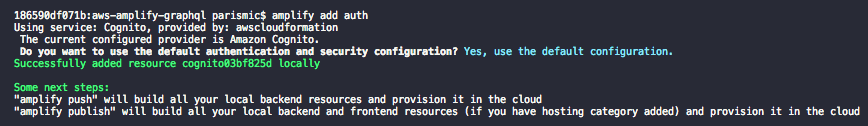
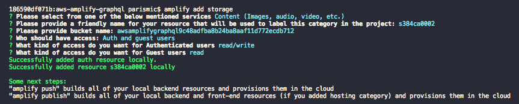
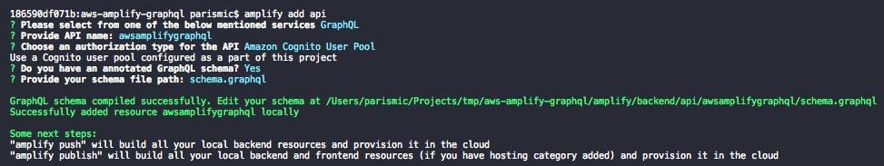

# MASTER BUILDER DEMO 2019-05

Working on making this a Master Builder test project.

# AWS AppSync GraphQL Photo Sample

**Please submit issues to the [appsync-sdk-js](https://github.com/awslabs/aws-mobile-appsync-sdk-js/issues) repository.**



This sample application shows how to use GraphQL to build an application that a user can login to the system, then upload and download photos which are private to them. The sample is written in React and uses AWS AppSync, Amazon Cognito, Amazon DynamoDB and Amazon S3 as well as the Amplify CLI.

## Architecture Overview


## Prerequisites
+ [AWS Account](https://aws.amazon.com/mobile/details/)

+ [NodeJS](https://nodejs.org/en/download/) with [NPM](https://docs.npmjs.com/getting-started/installing-node)

+ [AWS Ampify CLI](https://aws-amplify.github.io/)
  - `npm install -g @aws-amplify/cli`
  - `amplify configure` 

## Getting Started

1. Clone this repo locally.

```
git clone https://github.com/aws-samples/aws-amplify-graphql.git
cd aws-amplify-graphql
```

2. Initialize the amplify project.

```
amplify init
```

3. Configure an Amazon Cognito User Pool to manage user credentials.

```
amplify add auth
```



4. Configure an Amazon S3 bucket to store files.

```
amplify add storage
```



5. Configure an AWS AppSync API to interact with my backend data sources such as Amazon DynamoDB, Amazon Elasticsearch, AWS Lambda, and self hosted HTTP services. 

```
amplify add api

# When prompted for a schema.graphql provide the value "schema.graphql"
# to point to the file checked in to the root of the project directory.
```



> After running this command, you edit the schema.graphql located at `amplify/backend/api/<-projectname->/schema.graphql`. You may delete the one at the root of the project directory as it will no longer be used.

6. Deploy your project.

```
amplify push

# When asked if you would like to generate client code, you can
# say no since we are using plain JavaScript.
```

7. Install client dependencies.

```
npm install

# or
yarn
```

8. Run the react application

```
npm run start

# or
yarn start
```

The AWS Amplify CLI will create an Amazon Cognito User Pool and Identity Pool, an Amazon S3 bucket with private directories to store each user's photo and an AWS AppSync API that uses Amazon DynamoDB to store data.

The sample uses [AWS Amplify](https://github.com/aws/aws-amplify) to perform the Sign-Up and Sign-In flows with a Higher Order Component.

If the application runs successfully you should be able to enter the name of a photo, choose a file and then press **Add photo**. This will make a GraphQL call to enter the record into the database and simultaneously upload the object to S3. An immediate fetch of the record will then be at the bottom of the screen.


# OLD CONTENT
# Create-react-app with AWS Amplify Auth 

This auth starter implements withAuthenticator HOC to provide a basic authentication flow for signing up signing in users as well as protected client side routing using AWS Amplify. Auth features: User sign up, User sign in, Multi-factor Authentication, User sign-out.

[View Demo](https://master.d2ka7y7551sk8n.amplifyapp.com/)


## Deploy with the AWS Amplify Console

The AWS Amplify Console provides hosting for fullstack serverless web apps. [Learn more](https://console.amplify.aws). Deploy this app to your AWS account with a single click:

[](https://console.aws.amazon.com/amplify/home#/deploy?repo=https://github.com/aws-samples/create-react-app-auth-amplify)

The Amplify Console will fork this repo in your GitHub account, and then build and deploy your backend and frontend in a single workflow. Your app will be available at `https://master.appid.amplifyapp.com`.

## Run locally with the Amplify CLI

1. Clone the repo that was just forked in your account

  ```
  git clone git@github.com:<username>/create-react-app-auth-amplify.git

  cd create-react-app-auth-amplify && npm install
  ```

2. Import the backend environment deployed by the Amplify Console to your repo (the `amplify/team-provider.json` file contains information on all backend environments in your AWS account). The GIF below shows how you to copy the `amplify env import` command from the Amplify Console. 


3. Paste this command into your terminal at the root of your repo. You should see the `amplify/team-provider.json` updated with a backend named `amplify`.

  ```
  amplify env import --name amplify --config "{<stack>}" --awsInfo "{<profile>}" --yes

  Successfully added environment from your project
  ```

3. Initialize the Amplify CLI with the `amplify` environment.

  ```
  amplify init
  ? Do you want to use an existing environment? Yes
  ? Choose the environment you would like to use: (Use arrow keys)
  > amplify
  ```

4. Run locally

  ```
  npm start
  ```

Learn how to customize the sign-in UI [here](https://aws-amplify.github.io/docs/js/authentication#customize-ui).
